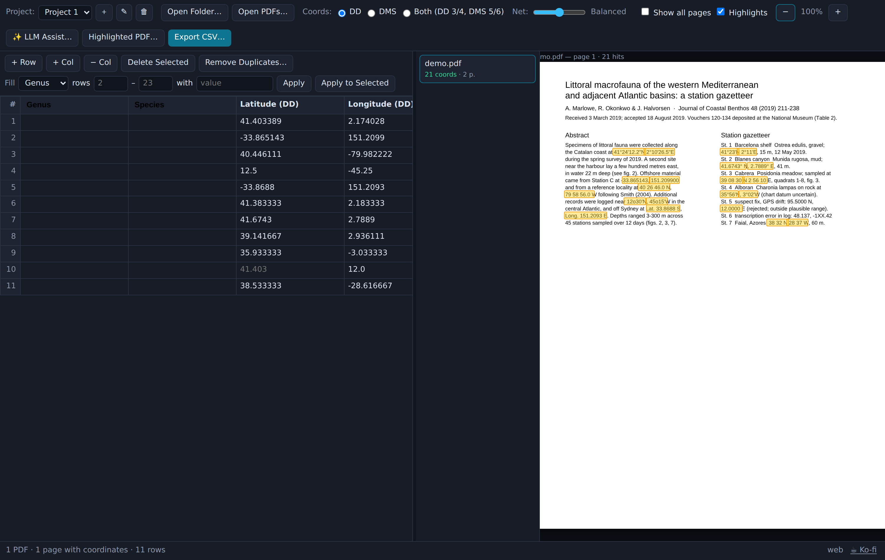
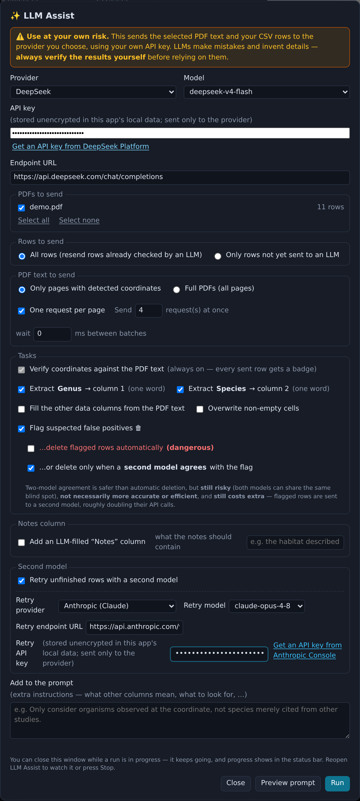

# CoordRippr 🌐⚔️

CoordRippr scans PDFs for latitude/longitude coordinates, highlights the matches
on the page, and exports them as an editable CSV. It handles multi-column
layouts (e.g. journal articles) and coordinate pairs split across lines or page
boundaries.

[](https://ko-fi.com/calebhendren)

Support development on [Ko-fi](https://ko-fi.com/calebhendren).



*A two-column journal article with deliberately awful coordinates — DMS with symbols, `o`-for-degree, signed decimals, space-separated DMS, `Lat./Long.` labels — all detected, while years, depths, voucher ranges and an out-of-range fix are ignored.*

## Features

- **Projects** — Multiple independent projects, each with its own PDFs, rows,
  column headers, and settings. Create, rename, and delete from the toolbar
  (`＋` / `✎` / `🗑`). State is saved per project.
- **Session persistence** — Files, extracted rows, edits, output format, zoom,
  and deletions are snapshotted to local storage as you work and restored on the
  next launch, including drag-and-dropped PDFs. Uses IndexedDB; if it is
  unavailable the app runs without persistence.
- **Batch scanning** — Opening a folder scans every PDF within it recursively.
  Individual file selection and drag-and-drop are also supported.
- **Detection** — Recognizes decimal degrees (`41.40338, 2.17403`) and DMS
  (`41°24'12.2"N`), including common degenerate forms:
  - `o` or `O` substituted for the degree symbol (`12o30'N`)
  - minute/second ticks: `'` `′` `’` `` ` `` `´`, `"` `″` `”`, and doubled ticks
  - hemisphere as a letter (`N`, `s`, and `O` for Spanish/Portuguese *Oeste* /
    French *Ouest* = West) or word (`South`, `West`, `Oeste`, `Ouest`), leading
    or trailing
  - `Lat.` / `Long.` labels, space-separated DMS (`40 26 46 N`), decimal commas
  - pairs split across line breaks, including across a page boundary (latitude at
    the foot of one page, longitude at the top of the next), and a single
    coordinate wrapped onto an indented continuation line
    (`104°`⏎`      43'46"W`) without losing the minutes/seconds
- **Detection intensity** — A toolbar slider controls parser aggressiveness over
  a seven-step net, *Strictest* (1) to *Everything* (7), with **Balanced** (5)
  the default. The four strictest steps give fine control over false positives —
  the pairing requirement loosens one notch at a time:
  1. **Strictest** — both halves strong (°, hemisphere, …); nothing kept alone
  2. **Strict** — both halves strong, but a lone strong coordinate is kept
  3. **Firm** — a strong half pairs only with another solid (≥ medium) half
  4. **Careful** — a strong half may pair with a weaker partner
  5. **Balanced** — the classic CoordRippr net (default)
  6. **Wide** — single-decimal numbers can pair, bigger gaps allowed
  7. **Everything** — even bare integer pairs; expect false positives

  Changing it re-scans the loaded PDFs in place, preserving edits, filled
  columns, and deletions.
  - **Per-PDF net** — each PDF in the file list has its own *Net* picker.
    *Auto* follows the global slider; pick a level (1–7) to pin just that PDF to
    a more aggressive (or stricter) net than the rest of the batch — useful for
    one messy document among clean ones. The override re-scans only that PDF (in
    place, edits preserved) and is saved with the session.
- **Page view** — Shows only pages with detections by default (*Show all pages*
  to view the rest). Matches are highlighted; hovering a highlight shows the raw
  matched text; the *Highlights* toggle hides the boxes. Clicking a CSV row
  scrolls to its highlight in the PDF, and clicking a highlight scrolls to its
  CSV row.
- **CSV table** — Editable table with a header row:
  - Columns 1–2 are user-defined (editable headers, **Genus** / **Species** by
    default); latitude/longitude occupy columns 3–4.
  - Output as **DD**, **DMS**, or **Both** (DD in columns 3/4, DMS in 5/6),
    independent of the source format.
  - Coordinate cells are reformatted to the selected output on entry;
    unparseable input is retained and flagged.
  - Range/selection fill for columns 1–2; `Ctrl+D` copies the cell above; row
    selection via shift/ctrl-click on the row numbers; add and delete rows.
  - *Remove Duplicates…* reports a count before applying, and can be restricted
    to rows that also match on columns 1–2 and/or originate from the same PDF.
- **Export** — CSV with a UTF-8 BOM for correct degree-symbol rendering in Excel.
- **LLM Assist** (requires an API key) — Sends page text to an LLM to verify the
  extracted coordinates and to populate the data columns from the surrounding
  text:
  - Providers: Anthropic (Claude), OpenAI, Google Gemini, DeepSeek, Qwen
    (Alibaba), Kimi (Moonshot), GLM (Zhipu), or any OpenAI-compatible endpoint.
    The API key is stored locally and sent only to the selected provider. A
    **Get an API key** link opens the provider's key page.
  - Per-provider model dropdown, plus a **Custom…** option for an arbitrary
    model ID.
  - **Genus / Species extraction** — explicit toggles that fill columns 1–2 from
    the text near each coordinate. Both are constrained to a single word
    (enforced in the prompt and again on the result), so `"Panthera leo"`
    returned for the genus is trimmed to `Panthera`. A separate **Fill the other
    data columns** option covers any additional columns you add.
  - **Second model** — a separate provider/model/key used by two features:
    - *Retry unfinished rows* — after the first model finishes, rows it could
      not verify/badge (or whose Genus/Species/filled columns are still empty)
      are automatically re-sent — e.g. `deepseek-v4-flash` first, then
      `deepseek-v4-pro` or Claude.
    - *Delete confirmation* — the second-model review described under
      false-positive flagging below.

    A second model on the **same provider** reuses the primary API key unless a
    *separate key* box is ticked; on a **different provider** it uses its own
    key. The settings only appear once one of the two features is enabled.
  - **Preview prompt** — shows the exact system and user messages that will be
    sent (built from the current settings and your first page of rows) before
    anything leaves your machine.
  - **Runs in the background** — the window can be closed without stopping a run;
    progress continues in the footer status bar, and reopening LLM Assist shows
    the live status or lets you press *Stop*.
  - **PDFs to send** — a checkbox list of the loaded PDFs (with *Select all* /
    *Select none*); only the ticked PDFs' rows and page text are sent, so a run
    can be limited to select documents. Rowless PDFs are disabled, and each
    PDF's sent-count is shown so you can see what a previous run already covered.
  - Scope: pages with detected coordinates only, or full PDFs.
  - Concurrency: a bounded request pool of configurable size (`1` = sequential).
    Most effective with **one request per page**, which splits a PDF into many
    small independent requests; reduce it if a provider rate-limits.
  - Batch delay: an optional interval (ms) between batches. When set, a batch of
    the configured pool size is dispatched on a fixed interval regardless of
    whether the previous batch has completed. `0` (default) retains the
    steady-pool behaviour.
  - **Advanced — model temperature**: off by default, in which case the field is
    omitted from every request and the provider's own default temperature applies
    (unchanged behaviour). Enabling it sends a sampling temperature (default
    `0.2`, applied to both the primary and second model) — low enough that the
    model follows the "verify and badge every row" instruction closely, so fewer
    rows come back without a ✓ / ⚠ / ? badge, while still extracting genus/species
    and requesting an adjacent page when a row needs one. OpenAI-compatible
    providers accept up to `2`; Anthropic caps at `1` and some current models
    reject the field outright.
  - Per-row verdict badge: ✓ confirmed, ⚠ mismatch (click to apply the suggested
    correction), ? not found. Rows the model skips are automatically re-sent
    until they come back badged.
  - False-positive flagging: optionally flags rows that are not coordinates
    (dates, measurements, page numbers, etc.) with a 🗑 marker for one-by-one or
    bulk removal (*Delete Flagged*). Two opt-in follow-ups (mutually exclusive,
    each reset per run and confirmed before starting):
    - **Automatic deletion** removes flagged rows without confirmation
      (*dangerous*).
    - **Two-model deletion** — the first model only flags; the second model
      reviews each flag and a row is deleted only if it also rejects it. Rows the
      second model does not confirm keep their 🗑 flag for manual review. Safer
      than single-model auto-delete, but still risky (the models can share a
      blind spot), not necessarily more accurate or efficient, and it costs extra
      (flagged rows are sent to a second model).
  - Optional LLM-filled **Notes** column with a free-text description of what the
    notes should contain.
  - LLM output is not authoritative. Verify all results against the source PDFs.

  
- **Update check** — Compares the running version against the latest GitHub
  release daily, and via a *Check for updates* button in the footer. Nothing is
  downloaded automatically.
- **Windows installer** — The `.exe` is an NSIS installer with a license page,
  install-location selection, desktop and start-menu shortcuts, and an
  uninstaller registered in *Apps & features*.

## Download

Builds are on the [Releases](../../releases) page:

| Platform | File |
| --- | --- |
| Windows | `CoordRippr-<version>-win-x64.exe` (NSIS installer) |
| macOS | `CoordRippr-<version>-mac-<arch>.dmg` |
| Ubuntu / Debian | `CoordRippr-<version>-linux-amd64.deb` |
| Fedora / RHEL | `CoordRippr-<version>-linux-x86_64.rpm` |
| Arch | `CoordRippr-<version>-linux-x64.pacman` |

The [GitHub Actions workflow](.github/workflows/build.yml) produces the builds.
Bumping the `version` in `package.json` and merging to `main` tags `v<version>`
and publishes a release with all installers attached (once per version). Pushing
a `v*` tag manually also works.

### Web version (GitHub Pages)

CoordRippr is plain JS and also runs entirely in the browser — no install, and
PDFs are processed locally in the page:
**https://calebhendren.github.io/CoordRippr/**

The [Pages workflow](.github/workflows/pages.yml) deploys on every push to
`main`. The first run requires GitHub Pages to be enabled; the workflow attempts
to enable it automatically, otherwise set *Settings → Pages → Source* to "GitHub
Actions". Browser-build caveats:

- Folder picking uses the File System Access API (Chrome/Edge only); other
  browsers fall back to a folder-upload prompt. Drag-and-drop works everywhere.
- LLM Assist calls the provider directly from the page, which some providers
  restrict via CORS. Anthropic, OpenAI, and Gemini work; some others may only
  work from the desktop app.

## Usage

1. **Open Folder…** (or *Open PDFs…*, or drag files in). Scanning starts
   immediately; the file list shows a hit count per PDF. Use a separate
   **project** per job to keep files, rows, and settings isolated; the last
   project is restored on the next launch.
2. Review the right panel: only pages with detections are shown, with hits
   highlighted. Hover a highlight to see the matched text. Adjust the **Net**
   slider to re-scan if the parser is too greedy or too conservative.
3. Fill columns 1–2 (site names, notes, etc.). For repeated values, use the
   *Fill* bar: select the column, a row range, and a value, then *Apply*.
4. Select the coordinate output format in the toolbar (DD / DMS / Both).
5. Correct any parser errors (edits are reformatted automatically) and delete
   false positives; the detection net is intentionally wide.
6. Optional: **LLM Assist…** — select a provider, enter an API key, toggle
   **Genus** / **Species** extraction (and any other tasks), optionally enable
   **Retry with a different model** for rows the first model can't finish, and
   run. Use **Preview prompt** to see exactly what will be sent first. The window
   can be closed while it runs — progress continues in the status bar. Review the
   results before relying on them.
7. **Export CSV…**

> Detection operates on the PDF text layer. Scanned or image-only PDFs contain no
> text to search; run OCR on them first.

## Development

```bash
npm install        # downloads Electron and pdf.js; requires network access
npm test           # parser / LLM / update unit tests + a pdf.js integration test
npm start          # run the app
npm run web        # build the static browser version into dist-web/
npm run dist       # package installers for the current platform
```

Key modules:

- `src/coords.js` — tokenizer, parser, formatter, intensity levels, and
  `extractCrossPage()`.
- `src/llm.js` — provider presets, request/response formats, prompt
  construction, work chunking, and the concurrency runners. Pure module, unit-
  tested.
- `src/persist.js` — IndexedDB-backed projects and session snapshots
  (`packState` / `unpackState` are pure and unit-tested).
- `src/pdftext.js` — pdf.js text items to a searchable string plus
  match-to-rectangle mapping.
- `tools/make-sample-pdf.mjs` — regenerates `test/fixtures/sample.pdf`, the
  two-column test document.
- `tools/make-demo-pdf.mjs` — regenerates the two-column "journal article" demo
  used for the README screenshot (`node tools/make-demo-pdf.mjs [outfile]`).
- `build/icon.svg` — icon source; rasterize with:
  ```bash
  npm i --no-save sharp
  node -e "require('sharp')('build/icon.svg').resize(1024,1024).png().toFile('build/icon.png')"
  ```

## License

MIT — see [LICENSE](LICENSE).
