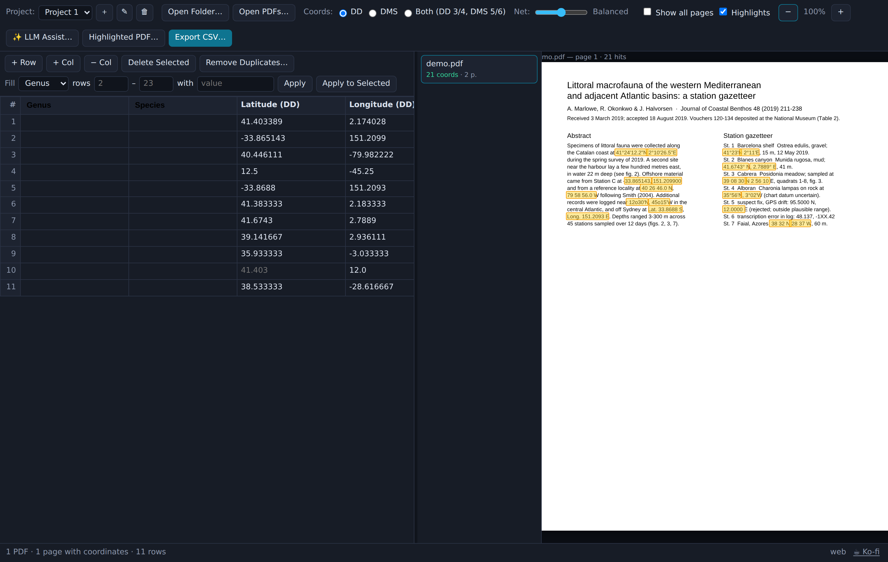
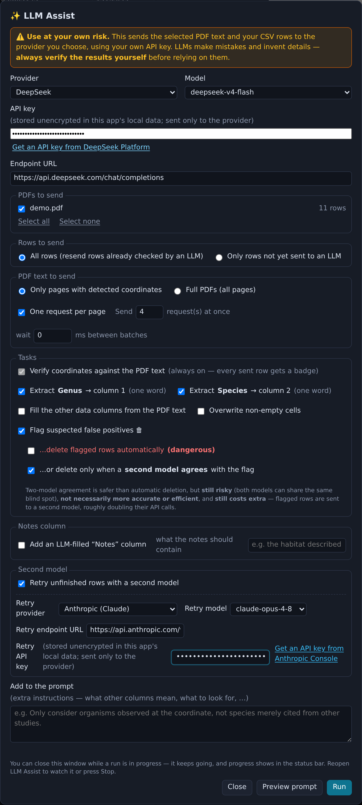

# CoordRippr 🌐⚔️

CoordRippr scans PDFs for latitude/longitude coordinates, highlights the matches
on the page, and exports them as an editable CSV. It handles multi-column
layouts (e.g. journal articles) and coordinate pairs split across lines or page
boundaries.

[](https://ko-fi.com/calebhendren)

Support development on [Ko-fi](https://ko-fi.com/calebhendren).



*A two-column journal article with deliberately awful coordinates — DMS with symbols, `o`-for-degree, signed decimals, space-separated DMS, `Lat./Long.` labels — all detected, while years, depths, voucher ranges and an out-of-range fix are ignored.*

## Features

- **Projects** — Multiple independent projects, each with its own PDFs, rows,
  column headers, and settings. Create, rename, and delete from the toolbar
  (`＋` / `✎` / `🗑`). State is saved per project.
- **Session persistence** — Files, extracted rows, edits, output format, zoom,
  and deletions are snapshotted as you work and restored on the next launch,
  including drag-and-dropped PDFs.
  - The desktop app keeps projects as plain files in its data folder
    (`%APPDATA%\CoordRippr\data` on Windows, `~/Library/Application Support/…`
    on macOS, `~/.config/…` on Linux), so **they survive app updates and
    reinstalls**. *Data folder…* in the footer moves that folder anywhere you
    like — put it in OneDrive or Dropbox and your projects follow you between
    machines. Projects from older versions are migrated automatically on first
    launch.
  - The browser build uses IndexedDB; if it is unavailable the app runs without
    persistence.
- **Export / import projects** — `📤` writes the whole project (rows, edits,
  headers, per-PDF settings, highlights, and optionally copies of the PDFs) to a
  single `.crproj` file; `📥` loads one back into a new project. A backup you can
  keep, hand to a colleague, or restore on another machine.
- **Batch scanning** — Opening a folder scans every PDF within it recursively.
  Individual file selection and drag-and-drop are also supported.
- **Detection** — Recognizes decimal degrees (`41.40338, 2.17403`) and DMS
  (`41°24'12.2"N`), including common degenerate forms:
  - `o` or `O` substituted for the degree symbol (`12o30'N`)
  - minute/second ticks: `'` `′` `’` `` ` `` `´`, `"` `″` `”`, and doubled ticks
  - hemisphere as a letter (`N`, `s`, and `O` for Spanish/Portuguese *Oeste* /
    French *Ouest* = West) or word (`South`, `West`, `Oeste`, `Ouest`), leading
    or trailing — a trailing one wins when both are present, since a leading
    letter is usually the orphan of a coordinate that failed to parse. Hemisphere
    words only count at the start of a word, so `at least 14` is not `east 14`
  - degrees spelled out where they touch the number (`10Deg 32'S`), but not
    detached prose (`rotated 30 degrees`)
  - a coordinate whose degrees the typesetter dropped, leaving minutes and a
    hemisphere (`100 ft., 17' N 104°46' W`)
  - `Lat.` / `Long.` labels, space-separated DMS (`40 26 46 N`), decimal commas
  - pairs split across line breaks, including across a page boundary (latitude at
    the foot of one page, longitude at the top of the next), and a single
    coordinate wrapped onto an indented continuation line
    (`104°`⏎`      43'46"W`) without losing the minutes/seconds
- **Detection intensity** — A toolbar slider controls parser aggressiveness over
  a twelve-step net, *Strictest* (1) to *Everything* (12), with **Strictest**
  the default — on real journal text it has by far the best precision, and the
  net is there to be widened when a document needs it. Two things loosen as the
  level rises: how strong each half of a pair must be, and how much text may sit
  between them.

  | # | Level | Pairing rule |
  | --- | --- | --- |
  | 1 | **Strictest** (default) | both halves strong (°, hemisphere, …); nothing kept alone |
  | 2 | Strict | both halves strong, but a lone strong coordinate is kept |
  | 3 | Firm | a strong half pairs only with another solid (≥ medium) half |
  | 4 | Firm (wider gap) | as Firm, more text allowed between the halves |
  | 5 | Careful | a strong half may pair with a weaker partner |
  | 6 | Careful (wider gap) | as Careful, more text allowed between the halves |
  | 7 | Balanced | the classic CoordRippr net |
  | 8 | Balanced (wider gap) | as Balanced, more text allowed between the halves |
  | 9 | Wide | single-decimal numbers can pair, bigger gaps allowed |
  | 10 | Wide (keeps lone medium) | as Wide, and a lone medium coordinate survives |
  | 11 | Everything | even bare integer pairs; expect false positives |
  | 12 | Everything (max gap) | as Everything, halves allowed far apart |

  Changing it re-scans the loaded PDFs in place, preserving edits, filled
  columns, deletions, and hand-marked coordinates. Projects saved by earlier
  versions keep the net they were scanned with (the old seven steps map onto
  1, 2, 3, 5, 7, 9 and 11).
  - **Per-PDF net** — each PDF in the file list has its own *Net* picker.
    *Auto* follows the global slider; pick a level (1–12) to pin just that PDF to
    a more aggressive (or stricter) net than the rest of the batch — useful for
    one messy document among clean ones. The override re-scans only that PDF (in
    place, edits preserved) and is saved with the session.
  - **Hide PDFs** — each PDF in the file list has a *Hide* button to set aside a
    document you decide isn't needed. A hidden PDF stays loaded but is excluded
    from the page view, the CSV table, exports and LLM runs, and it drops out of
    the file list entirely into a collapsed *“N hidden PDFs”* disclosure at the
    bottom; expand it and click *Show* to bring any of them back — nothing is
    deleted. Hidden state is saved with the session. (To remove a PDF's data
    permanently, delete its rows instead.)
- **Duplicate PDFs** — the same paper often arrives twice, once as `168766.pdf`
  and once as `Xenopygus_marginatus.pdf`, and its rows are then indistinguishable
  from real ones. *Duplicate PDFs…* matches the loaded documents on their
  **contents, never their names**: identical bytes (a literal re-download), or
  identical extracted text (the same paper re-saved by a different tool). What it
  finds goes into a review window with a keeper pre-selected per group — pick a
  different copy to keep if you like — and the rest are **set aside** using the
  same Hide mechanism, so nothing is deleted and *Show* brings them back. A
  folder scan that turns up candidates says so in the status bar but changes
  nothing on its own. Note that a scanned PDF has no text layer and so no text
  fingerprint; those are matched byte-for-byte only.
- **Page view** — Shows only pages with detections by default (*Show all pages*
  to view the rest). Matches are highlighted; hovering a highlight shows the raw
  matched text; the *Highlights* toggle hides the boxes. Clicking a CSV row
  scrolls to its highlight in the PDF, and clicking a highlight scrolls to its
  CSV row.
- **Mark a coordinate by hand** — Some coordinates are simply not in the text
  layer: the degrees were dropped by the typesetter, the glyphs came out as
  garbage, the page is a scan. Press *✥ Mark coord*, drag a box around the
  coordinate on the page, and type the values. CoordRippr reads whatever text
  sits under the box and pre-fills the fields, so usually you only correct it.
  The box becomes a green dashed highlight linked to its row in both directions,
  it is baked into the highlighted-PDF export, and re-scans and net changes leave
  it alone. With a single row selected you can attach the box to that row instead
  of creating a new one.
- **CSV table** — Editable table with a header row:
  - Columns 1–2 are user-defined (editable headers, **Genus** / **Species** by
    default); latitude/longitude occupy columns 3–4.
  - Output as **DD**, **DMS**, or **Both** (DD in columns 3/4, DMS in 5/6),
    independent of the source format.
  - Coordinate cells are reformatted to the selected output on entry;
    unparseable input is retained and flagged.
  - Range/selection fill for columns 1–2; `Ctrl+D` copies the cell above; row
    selection via shift/ctrl-click on the row numbers; add and delete rows.
    *+ Row* inserts directly **below the selected row** (at the end when nothing
    is selected).
  - *Remove Duplicates…* reports a count before applying, and can be restricted
    to rows that also match on columns 1–2 and/or originate from the same PDF.
  - *↩ Restore Deleted* — deleting a row also suppresses that detection for good,
    through re-scans and every net level. The button appears with a count
    whenever a project has suppressed detections and forgets them all, so a row
    deleted by mistake can come back.
- **Export** — CSV with a UTF-8 BOM for correct degree-symbol rendering in Excel.
- **LLM Assist** (requires an API key) — Sends page text to an LLM to verify the
  extracted coordinates and to populate the data columns from the surrounding
  text:
  - Providers: Anthropic (Claude), OpenAI, Google Gemini, DeepSeek, Qwen
    (Alibaba), Kimi (Moonshot), GLM (Zhipu), or any OpenAI-compatible endpoint.
    The API key is stored locally and sent only to the selected provider. A
    **Get an API key** link opens the provider's key page.
  - Per-provider model dropdown, plus a **Custom…** option for an arbitrary
    model ID.
  - **Genus / Species extraction** — explicit toggles that fill columns 1–2 from
    the text near each coordinate. Both are constrained to a single word
    (enforced in the prompt and again on the result), so `"Panthera leo"`
    returned for the genus is trimmed to `Panthera`. A separate **Fill the other
    data columns** option covers any additional columns you add.
  - **Text anchors** (on by default) — a page can carry a dozen coordinates that
    read alike, and without help the model has to guess which one produced which
    row. Every row is instead tied to the exact span of page text its coordinate
    was detected in — the same span the yellow highlight covers. That span is
    wrapped in `[[r12.lat]]…[[/]]` markers in the text that is sent, and repeated
    under the row with its page, character offsets and matched text, so the row's
    verdict, genus, species, notes and flags all come from the right sentence.
    Verdicts follow the anchor: ✓ and ⚠ judge the anchored span itself, and
    coordinates marked by hand — which have no text-layer span — are the rows
    that can still come back `?`. Untick *Anchor each row to the exact text it
    was found in* to send the plain page text instead.
  - **Second model** — a separate provider/model/key used by two features:
    - *Retry unfinished rows* — after the first model finishes, rows it could
      not verify/badge (or whose Genus/Species/filled columns are still empty)
      are automatically re-sent — e.g. `deepseek-v4-flash` first, then
      `deepseek-v4-pro` or Claude.
    - *Delete confirmation* — the second-model review described under
      false-positive flagging below.

    A second model on the **same provider** reuses the primary API key unless a
    *separate key* box is ticked; on a **different provider** it uses its own
    key. The settings only appear once one of the two features is enabled.
  - **Preview prompt** — shows the exact system and user messages that will be
    sent (built from the current settings and your first page of rows) before
    anything leaves your machine, anchor markers included.
  - **Runs in the background** — the window can be closed without stopping a run;
    progress continues in the footer status bar, and reopening LLM Assist shows
    the live status or lets you press *Stop*.
  - **PDFs to send** — a checkbox list of the loaded PDFs (with *Select all* /
    *Select none*); only the ticked PDFs' rows and page text are sent, so a run
    can be limited to select documents. Rowless PDFs are disabled, and each
    PDF's sent-count is shown so you can see what a previous run already covered.
  - Scope: pages with detected coordinates only, or full PDFs.
  - Concurrency: a bounded request pool of configurable size (`1` = sequential).
    Most effective with **one request per page**, which splits a PDF into many
    small independent requests; reduce it if a provider rate-limits.
  - Batch delay: an optional interval (ms) between batches. When set, a batch of
    the configured pool size is dispatched on a fixed interval regardless of
    whether the previous batch has completed. `0` (default) retains the
    steady-pool behaviour.
  - **Advanced — model temperature**: off by default, in which case the field is
    omitted from every request and the provider's own default temperature applies
    (unchanged behaviour). Enabling it sends a sampling temperature (default
    `0.2`, applied to both the primary and second model) — low enough that the
    model follows the "verify and badge every row" instruction closely, so fewer
    rows come back without a ✓ / ⚠ / ? badge, while still extracting genus/species
    and requesting an adjacent page when a row needs one. OpenAI-compatible
    providers accept up to `2`; Anthropic caps at `1` and some current models
    reject the field outright.
  - Per-row verdict badge: ✓ confirmed, ⚠ mismatch (click to apply the suggested
    correction), ? not found. With text anchors on, ✓ and ⚠ are judgements about
    the anchored span itself and ? is reserved for rows with no anchor in the
    request, so ? gets rare and a ⚠ means the anchored text really does say
    something else. Rows the model skips are automatically re-sent until they
    come back badged.
  - False-positive flagging: optionally flags rows that are not coordinates
    (dates, measurements, page numbers, etc.) with a 🗑 marker for one-by-one or
    bulk removal (*Delete Flagged*). Two opt-in follow-ups (mutually exclusive,
    each reset per run and confirmed before starting):
    - **Automatic deletion** removes flagged rows without confirmation
      (*dangerous*).
    - **Two-model deletion** — the first model only flags; the second model
      reviews each flag and a row is deleted only if it also rejects it. Rows the
      second model does not confirm keep their 🗑 flag for manual review. Safer
      than single-model auto-delete, but still risky (the models can share a
      blind spot), not necessarily more accurate or efficient, and it costs extra
      (flagged rows are sent to a second model).
  - Optional LLM-filled **Notes** column with a free-text description of what the
    notes should contain.
  - **Rename PDFs** — papers often arrive as `168766.pdf`. Tick *Suggest a file
    name for each selected PDF* (or press *Suggest names now…*) and the model
    reads the opening pages of each ticked PDF and proposes a name; by default
    *the genus discussed in the paper*, so `168766.pdf` becomes `Xenopygus.pdf`.
    Every suggestion lands in a review window where you can edit the names and
    untick any you want left alone — **nothing on disk changes until you press
    Apply**. Apply writes copies into a subfolder (`renamed` by default) and
    leaves the originals untouched; renaming the originals in place is a separate,
    confirmed choice. Names are sanitised for the filesystem and de-duplicated,
    and an existing file is never overwritten. In the browser build, Apply
    downloads the renamed copies instead.
  - LLM output is not authoritative. Verify all results against the source PDFs.

  
- **Colour schemes** — 🎨 in the footer switches the whole window between
  **Midnight** (the original), **Amethyst** (Midnight with the blues replaced by
  light purple), **Dracula** and **Nord**. Highlight colours are tuned per theme
  so detections stay legible over a white page. The choice is saved with your
  other settings, so it survives updates too.
- **Update check** — Compares the running version against the latest GitHub
  release daily, and via a *Check for updates* button in the footer. Nothing is
  downloaded automatically.
- **Windows installer** — The `.exe` is an NSIS installer with a license page,
  install-location selection, desktop and start-menu shortcuts, and an
  uninstaller registered in *Apps & features*.

## Download

Builds are on the [Releases](../../releases) page:

| Platform | File |
| --- | --- |
| Windows | `CoordRippr-<version>-win-x64.exe` (NSIS installer) |
| macOS | `CoordRippr-<version>-mac-<arch>.dmg` |
| Ubuntu / Debian | `CoordRippr-<version>-linux-amd64.deb` |
| Fedora / RHEL | `CoordRippr-<version>-linux-x86_64.rpm` |
| Arch | `CoordRippr-<version>-linux-x64.pacman` |

The [GitHub Actions workflow](.github/workflows/build.yml) produces the builds.
Bumping the `version` in `package.json` and merging to `main` tags `v<version>`
and publishes a release with all installers attached (once per version). Pushing
a `v*` tag manually also works.

### Web version (GitHub Pages)

CoordRippr is plain JS and also runs entirely in the browser — no install, and
PDFs are processed locally in the page:
**https://calebhendren.github.io/CoordRippr/**

The [Pages workflow](.github/workflows/pages.yml) deploys on every push to
`main`. The first run requires GitHub Pages to be enabled; the workflow attempts
to enable it automatically, otherwise set *Settings → Pages → Source* to "GitHub
Actions". Browser-build caveats:

- Folder picking uses the File System Access API (Chrome/Edge only); other
  browsers fall back to a folder-upload prompt. Drag-and-drop works everywhere.
- LLM Assist calls the provider directly from the page, which some providers
  restrict via CORS. Anthropic, OpenAI, and Gemini work; some others may only
  work from the desktop app.

## Usage

1. **Open Folder…** (or *Open PDFs…*, or drag files in). Scanning starts
   immediately; the file list shows a hit count per PDF. Use a separate
   **project** per job to keep files, rows, and settings isolated; the last
   project is restored on the next launch.
2. Review the right panel: only pages with detections are shown, with hits
   highlighted. Hover a highlight to see the matched text. Adjust the **Net**
   slider to re-scan if the parser is too conservative (or, higher up, too
   greedy) — it starts at *Strictest*. For a coordinate the parser cannot read
   at any level, use **✥ Mark coord** and draw a box around it.
3. Fill columns 1–2 (site names, notes, etc.). For repeated values, use the
   *Fill* bar: select the column, a row range, and a value, then *Apply*.
4. Select the coordinate output format in the toolbar (DD / DMS / Both).
5. Correct any parser errors (edits are reformatted automatically) and delete
   false positives; the detection net is intentionally wide.
6. Optional: **LLM Assist…** — select a provider, enter an API key, toggle
   **Genus** / **Species** extraction (and any other tasks), optionally enable
   **Retry with a different model** for rows the first model can't finish, and
   run. Use **Preview prompt** to see exactly what will be sent first. The window
   can be closed while it runs — progress continues in the status bar. Review the
   results before relying on them.
7. **Export CSV…**

> Detection operates on the PDF text layer. Scanned or image-only PDFs contain no
> text to search; run OCR on them first.

## Development

```bash
npm install        # downloads Electron and pdf.js; requires network access
npm test           # parser / LLM / update unit tests + a pdf.js integration test
npm start          # run the app
npm run web        # build the static browser version into dist-web/
npm run dist       # package installers for the current platform
```

Key modules:

- `src/coords.js` — tokenizer, parser, formatter, intensity levels, and
  `extractCrossPage()`.
- `src/llm.js` — provider presets, request/response formats, prompt
  construction (including the row-to-text anchoring), work chunking, and the
  concurrency runners. Pure module, unit-tested.
- `src/pdfid.js` — duplicate-PDF detection: text normalisation, the document
  fingerprint and its minimum-text guard, hashing, and grouping. Pure module,
  unit-tested.
- `src/persist.js` — projects and session snapshots over two interchangeable
  back ends: plain files in the data folder (Electron) and IndexedDB (browser).
  `packState` / `unpackState` / `migrateSnapshot` are pure and unit-tested.
- `src/projectio.js` — the portable `.crproj` export bundle. Pure module.
- `src/pdftext.js` — pdf.js text items to a searchable string plus
  match-to-rectangle mapping.
- `tools/make-sample-pdf.mjs` — regenerates `test/fixtures/sample.pdf`, the
  two-column test document.
- `tools/make-demo-pdf.mjs` — regenerates the two-column "journal article" demo
  used for the README screenshot (`node tools/make-demo-pdf.mjs [outfile]`).
- `build/icon.svg` — icon source; rasterize with:
  ```bash
  npm i --no-save sharp
  node -e "require('sharp')('build/icon.svg').resize(1024,1024).png().toFile('build/icon.png')"
  ```

## License

MIT — see [LICENSE](LICENSE).
